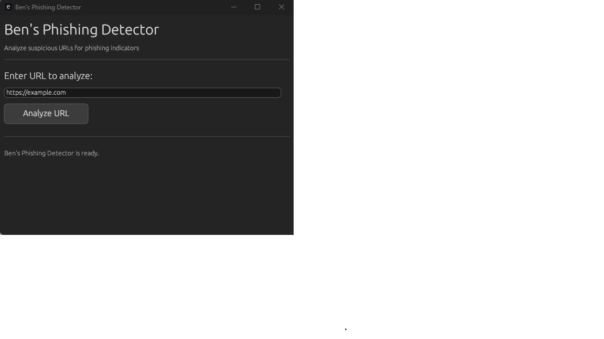

# Ben's Phishing Detector

A Rust-based desktop phishing detection tool with a dark-themed GUI that analyzes URLs for suspicious indicators such as missing HTTPS, IP-based domains, and phishing-related keywords.

## Preview

[Ben's Phishing Detector Main Window]

  

## Features

- Desktop GUI built with Rust using `eframe` and `egui`
- Detects missing HTTPS
- Flags IP-based URLs
- Identifies suspicious phishing keywords
- Displays risk level and indicators in a clean desktop interface

- ## Run on Terminal
- cargo build
- cargo run
